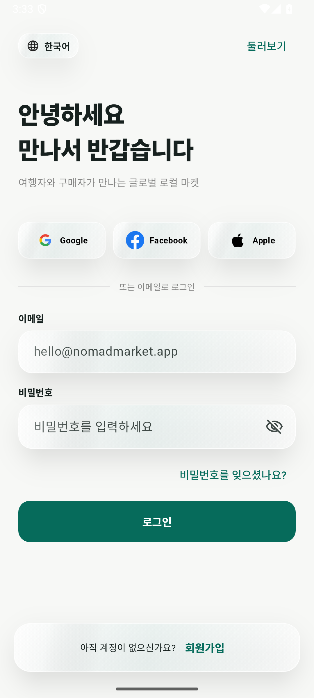

# Nomad Market

**Nomad Market** is a cross-border local-shopping marketplace where travelers and local experts surface city-specific products, verify them in person, and connect purchase requests with their next trip.

The original v2 already revolved around **Shopping / Community / Chat / My**, traveler profiles, local trends, culture guides, and safe transactions. The portfolio version keeps that product DNA rather than replacing it with a generic neighborhood marketplace: Paris limited goods, Tokyo flagship exclusives, K-beauty showroom finds, traveler arrival schedules, local-expert purchase requests, LIVE shopping, and culture context are all first-class parts of the app.

## Preview

<p align="center">
  
  
  
</p>

<p align="center">
  
  
</p>

<p align="center">
  
  
</p>

<p align="center">
  
  
</p>

All preview images above were captured from an Android 15 emulator at **1080 × 2400** after navigating the real app.

## What it does

- **Global Shopping Home** — `Paris → Seoul` trip context, luxury / limited / K-beauty categories, traveler-verified local picks, local trends, recommended experts, and cultural insight.
- **Search & Category** — city/product search, original Nomad-oriented categories, result counts, sorting, and a dedicated empty state.
- **Purchase Request Detail** — local sourcing location, traveler arrival/delivery schedule, expert trust history, in-app chat, favorites, and an interactive purchase-request bottom sheet.
- **Local Find Registration** — travelers can register an item they found locally with photo, expected purchase price, city/store, Korea arrival schedule, notes, validation, and keyboard-safe scrolling.
- **My Nomad** — traveler trust profile, active cities, next `Paris → Seoul` itinerary, local picks, saved finds, purchase-request messages, culture guide, and safety center.
- **Community & Chat** — the original LIVE / Story / Local Tip direction remains central, while the Chat tab is explicitly organized around requests to verified local experts.
- **Onboarding & Account Setup** — the earlier Nomad Market lineage's six onboarding illustrations, multilingual intro, social/email login, and seven-stage signup flow are restored and connected before the marketplace. Signup covers email verification, traveler profile, activity region, languages, currencies, and Buyer / Seller intent.

## Original v2 DNA preserved

- The original **Shopping / Community / Chat / My** application surface is retained as the primary bottom navigation.
- `TravelerProfileCard`, `LocalTrendCard`, and `CulturalInsightCard` remain product concepts and are upgraded into data-driven, interactive portfolio components instead of being removed.
- `CultureGuideScreen`, `SafetyCenterScreen`, `ChatListScreen`, `ChatScreen`, and the traveler trust model remain connected to the core shopping flow.
- The marketplace is intentionally about **city-specific sourcing and traveler movement**, not a generic local C2C feed.
- The polished onboarding/auth experience from the earlier Nomad Market repositories is restored with its original six onboarding artworks and account-setup concepts instead of being replaced by a generic splash/login template.

## Architecture

```text
lib/
├── data/       # deterministic demo marketplace catalog
├── models/     # marketplace item domain model
├── screens/    # onboarding, auth, marketplace, search, listing, detail, chat, community, profile
├── theme/      # Material 3 design tokens and shared visual language
├── widgets/    # resilient imagery and reusable marketplace cards
└── main.dart
```

- `main.dart` connects the restored onboarding/auth flow to the marketplace without requiring backend credentials.
- `models/` and `data/` provide the deterministic marketplace state used by the portfolio flow.
- `theme/` and reusable `widgets/` keep the marketplace, auth, and community screens visually consistent.
- Product imagery, onboarding artwork, and account visuals are bundled locally so the representative flow is deterministic.

## Tech Stack

- Flutter 3.27 / Dart 3.6
- Material 3
- Stateful Flutter UI for favorites, filters, validation, chat, onboarding, and signup progression
- SafeArea / responsive scrolling for modern Android screens
- Local deterministic sample data for portfolio browsing
- Android Emulator validation on API 35

### Demo data

This repository does not require Firebase credentials, API keys, or an account to demonstrate the product. The current v2 codebase uses a deterministic local catalog plus bundled marketplace imagery so every portfolio flow remains navigable without backend credentials. The account setup flow is fully navigable as UI/state in the portfolio build, while production cloud authentication is not claimed.

The current repository does **not** claim a production backend, production cloud authentication, escrow implementation, or cloud image upload that is not present in the source.

## Run

```bash
flutter pub get
flutter run -d <android-device-id>
```

## Validation

The portfolio build is checked with:

```bash
flutter analyze
flutter test
flutter build apk --debug
```

The representative flows were also exercised on an Android 15 / API 35 Medium Phone emulator, including restored onboarding, login, signup progression, global shopping Home, search/category results, product sourcing detail, purchase-request interaction, chat, local-find registration, My Nomad itinerary state, and Community LIVE.

Additional interaction/state captures are available in:

- `.github/assets/portfolio/06-chat.png` — purchase-request conversations grouped by traveler arrival schedule
- `.github/assets/portfolio/07-community.png` — LIVE local shopping / product verification
- `.github/assets/portfolio/08-purchase-request.png` — interactive local purchase-request sheet
- `.github/assets/portfolio/09-local-experts.png` — local trends, recommended travelers, and cultural insight sections
- `.github/assets/portfolio/08-onboarding-welcome.png` — restored first onboarding page using the original Nomad artwork
- `.github/assets/portfolio/09-onboarding-local-shopping.png` — original local-shopping onboarding concept
- `.github/assets/portfolio/10-login.png` — multilingual/social/email login surface
- `.github/assets/portfolio/11-signup-basic-info.png` — signup basic information step
- `.github/assets/portfolio/12-signup-profile.png` — traveler profile setup
- `.github/assets/portfolio/13-signup-mode.png` — currency and Buyer / Seller intent setup
- `.github/assets/portfolio/14-signup-complete.png` — completed account summary before entering Nomad Market
