# Nomad Market

**Nomad Market** is a cross-border local-shopping marketplace where travelers and local experts discover city-specific products, verify them in person, and connect purchase requests with upcoming trips.

**Nomad Market**은 여행자와 현지 전문가가 도시별 상품을 직접 발견하고 확인한 뒤, 다음 여행 일정과 구매 요청을 연결하는 **글로벌 로컬 쇼핑 마켓플레이스**입니다.

The product is intentionally built around traveler movement, local culture, and city-specific sourcing rather than a generic neighborhood resale feed. Paris limited goods, Tokyo flagship exclusives, K-beauty showroom finds, local-expert requests, LIVE shopping, culture guides, and safe-deal concepts all remain part of the original Nomad Market direction.

일반적인 동네 중고거래 앱이 아니라 **여행 동선, 현지 문화, 도시별 소싱**을 중심으로 설계했습니다. 파리 한정판, 도쿄 플래그십 전용 상품, K-뷰티 쇼룸, 현지 전문가 구매 요청, LIVE 쇼핑, 문화 가이드와 안전거래 개념이 모두 Nomad Market의 핵심 경험으로 이어집니다.

## Preview / 사용자 흐름

The preview follows the same order a first-time user would experience the service.

처음 서비스를 사용하는 사용자가 실제로 경험하는 순서대로 화면을 정리했습니다.

### 1. Getting Started / 시작하기

<table>
  <tr>
    <td width="50%" align="center">
      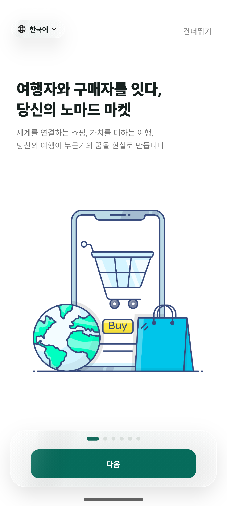<br />
      <b>1. Welcome Onboarding / 첫 온보딩</b><br />
      <sub>Introduces the traveler-to-buyer marketplace concept.<br />여행자와 구매자를 연결하는 Nomad Market의 핵심 컨셉을 소개합니다.</sub>
    </td>
    <td width="50%" align="center">
      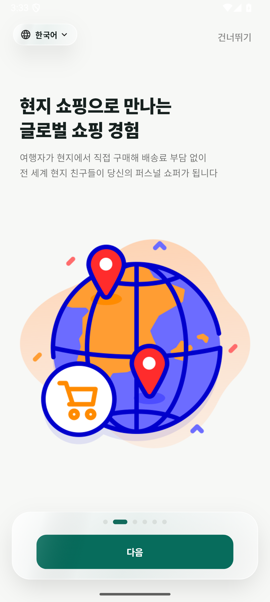<br />
      <b>2. Local Shopping Concept / 글로벌 로컬 쇼핑</b><br />
      <sub>Explains how travelers become local personal shoppers.<br />여행자가 현지에서 상품을 확인하고 퍼스널 쇼퍼처럼 연결되는 방식을 설명합니다.</sub>
    </td>
  </tr>
  <tr>
    <td width="50%" align="center">
      <br />
      <b>3. Login / 로그인</b><br />
      <sub>Google, Facebook, and Apple are presented consistently as logo + text buttons, alongside email login and multilingual access.<br />Google · Facebook · Apple 소셜 로그인을 모두 로고 + 텍스트 버튼으로 통일하고, 이메일 로그인과 다국어 진입점도 함께 제공합니다.</sub>
    </td>
    <td width="50%" align="center">
      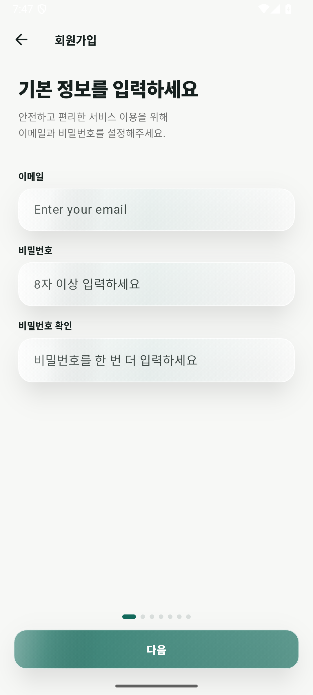<br />
      <b>4. Basic Account Info / 회원가입 기본정보</b><br />
      <sub>Starts the seven-step account setup flow.<br />이메일과 비밀번호를 시작으로 7단계 회원가입 흐름을 시작합니다.</sub>
    </td>
  </tr>
  <tr>
    <td width="50%" align="center">
      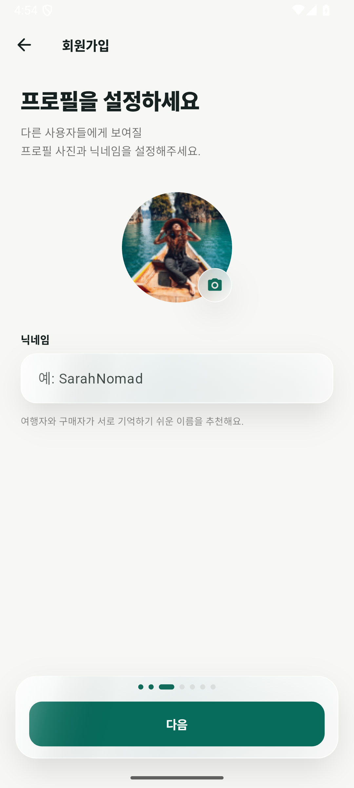<br />
      <b>5. Traveler Profile / 프로필 설정</b><br />
      <sub>Creates the identity other buyers and travelers will see.<br />다른 사용자에게 보여질 프로필 사진과 닉네임을 설정합니다.</sub>
    </td>
    <td width="50%" align="center">
      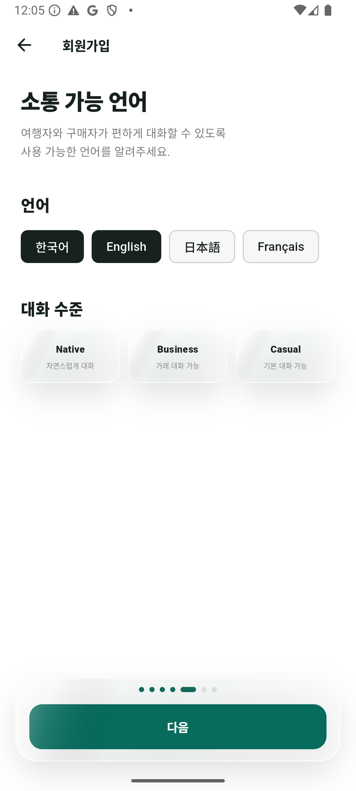<br />
      <b>6. Currency & User Mode / 통화와 이용 모드</b><br />
      <sub>Selects preferred currencies and Buyer / Seller intent.<br />선호 통화와 Buyer / Seller 이용 목적을 선택합니다.</sub>
    </td>
  </tr>
  <tr>
    <td colspan="2" align="center">
      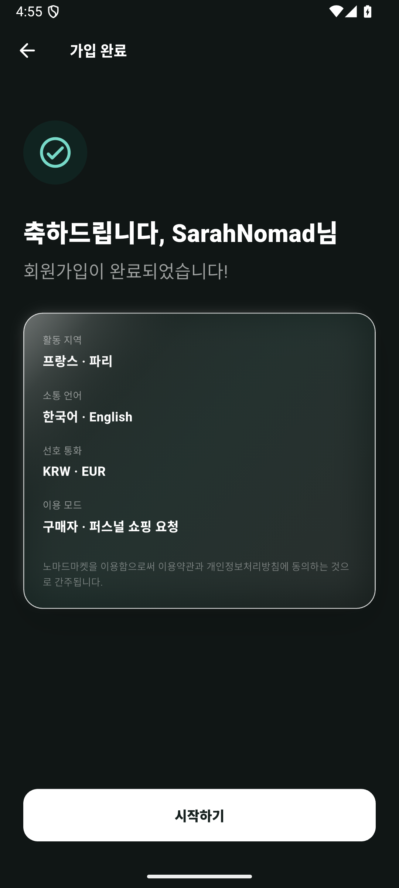<br />
      <b>7. Signup Complete / 가입 완료</b><br />
      <sub>Summarizes region, languages, currencies, and user mode before entering the marketplace.<br />활동 지역, 언어, 통화, 이용 모드를 확인한 뒤 마켓으로 진입합니다.</sub>
    </td>
  </tr>
</table>

### 2. Discover & Request / 탐색과 구매 요청

<table>
  <tr>
    <td width="50%" align="center">
      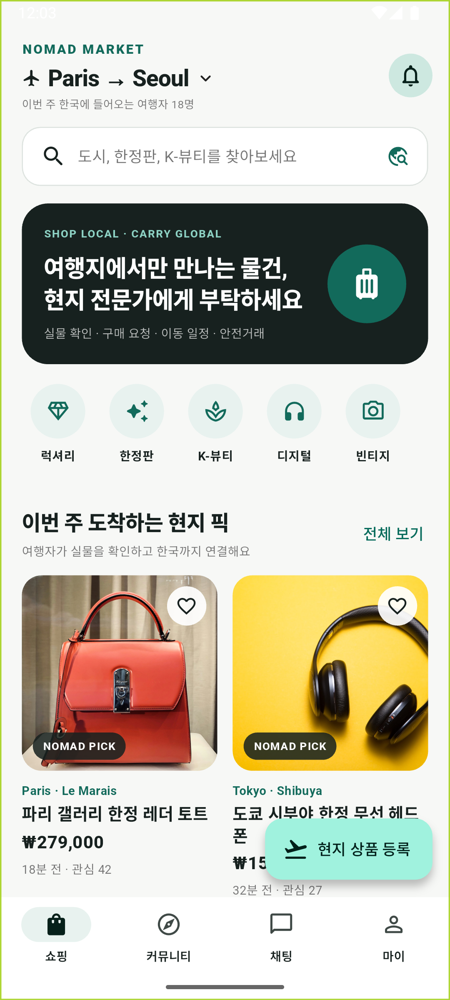<br />
      <b>8. Global Shopping Home / 글로벌 쇼핑 홈</b><br />
      <sub>Shows the active trip context, local picks, categories, and traveler-powered discovery.<br />현재 여행 동선, 현지 픽, 카테고리와 여행자 기반 상품 탐색을 보여줍니다.</sub>
    </td>
    <td width="50%" align="center">
      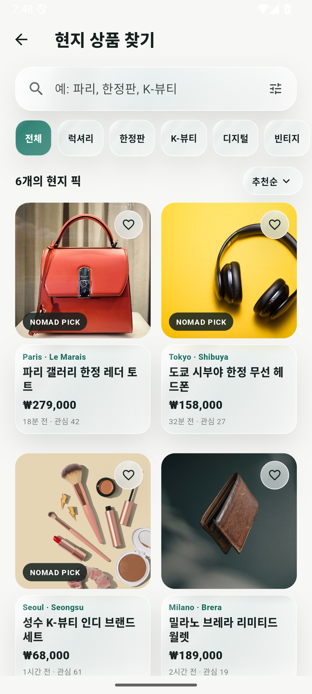<br />
      <b>9. Search & Category / 검색과 카테고리</b><br />
      <sub>Searches by city, limited goods, K-beauty, and original Nomad categories.<br />도시, 한정판, K-뷰티 등 Nomad Market 특화 카테고리로 상품을 탐색합니다.</sub>
    </td>
  </tr>
  <tr>
    <td width="50%" align="center">
      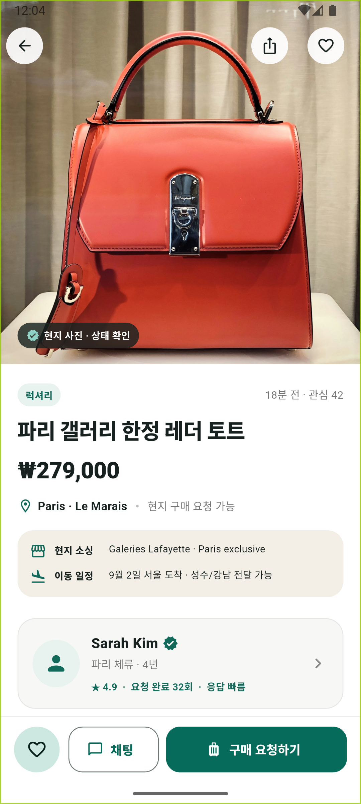<br />
      <b>10. Product Detail / 상품 상세</b><br />
      <sub>Combines sourcing location, seller trust, arrival schedule, condition, and purchase context.<br />소싱 지역, 판매자 신뢰도, 도착 일정, 상품 상태와 구매 맥락을 함께 제공합니다.</sub>
    </td>
    <td width="50%" align="center">
      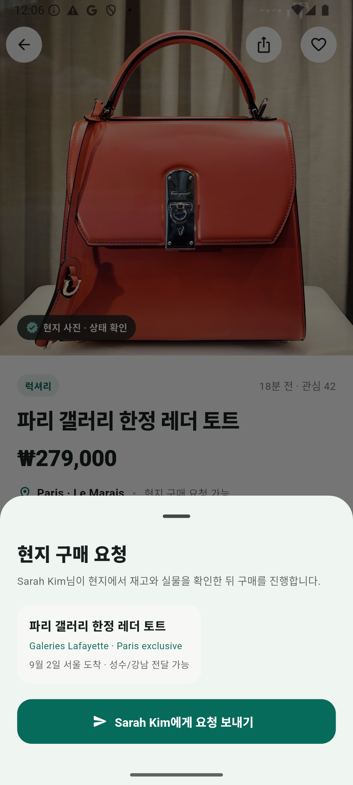<br />
      <b>11. Purchase Request / 구매 요청</b><br />
      <sub>Turns product discovery into a concrete request to a local expert or traveler.<br />탐색한 상품을 현지 전문가 또는 여행자에게 실제 구매 요청으로 연결합니다.</sub>
    </td>
  </tr>
  <tr>
    <td colspan="2" align="center">
      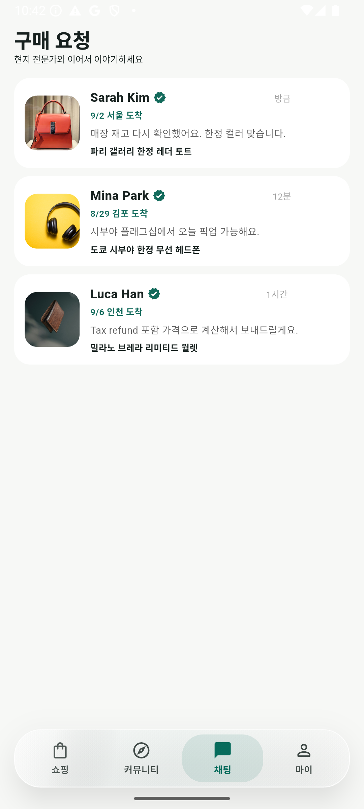<br />
      <b>12. Request Chat / 구매 요청 채팅</b><br />
      <sub>Continues price, condition, pickup, and arrival-schedule discussion inside the app.<br />가격, 상태, 픽업 방법, 입국 일정을 앱 내 채팅에서 이어서 협의합니다.</sub>
    </td>
  </tr>
</table>

### 3. Sell & Manage / 등록과 관리

<table>
  <tr>
    <td width="50%" align="center">
      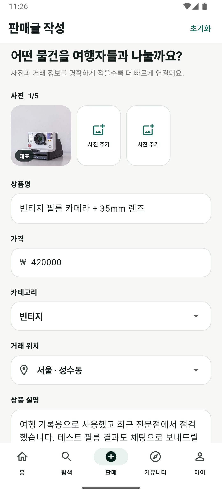<br />
      <b>13. Local Find Registration / 현지 상품 등록</b><br />
      <sub>Lets travelers register items found during a trip with city, price, schedule, and notes.<br />여행자가 현지에서 발견한 상품을 도시, 가격, 이동 일정과 함께 등록합니다.</sub>
    </td>
    <td width="50%" align="center">
      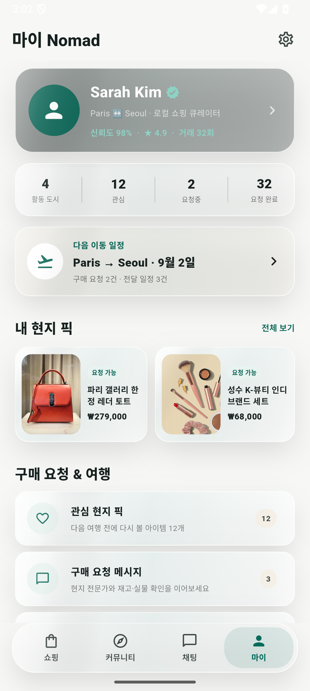<br />
      <b>14. My Nomad / 마이 노마드</b><br />
      <sub>Summarizes trust, active listings, saved items, messages, and upcoming travel routes.<br />신뢰도, 판매글, 관심 상품, 메시지와 다음 여행 일정을 한곳에서 관리합니다.</sub>
    </td>
  </tr>
  <tr>
    <td colspan="2" align="center">
      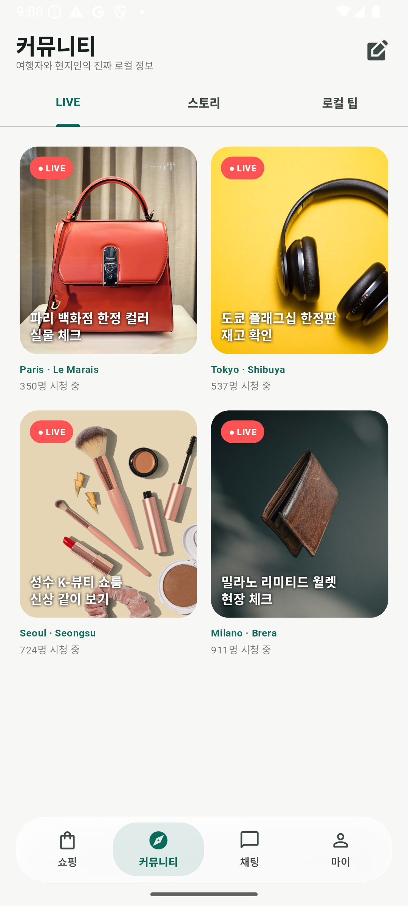<br />
      <b>15. Community & LIVE / 커뮤니티와 LIVE</b><br />
      <sub>Extends shopping into local stories, real-time product checks, and cultural exchange.<br />로컬 스토리, 실시간 상품 확인, 문화 교류로 쇼핑 경험을 확장합니다.</sub>
    </td>
  </tr>
</table>

All screenshots were captured from the real Android app on an Android 15 / API 35 emulator at **1080 × 2400**.

모든 이미지는 **Android 15 / API 35 / 1080 × 2400** 에뮬레이터에서 실제 앱을 직접 조작해 캡처했습니다.

## What it does / 주요 기능

- **Global Shopping Home / 글로벌 쇼핑 홈** — `Paris → Seoul` trip context, city-specific picks, luxury / limited / K-beauty categories, traveler recommendations, and local culture context.<br>
  `Paris → Seoul` 여행 동선, 도시별 현지 상품, 럭셔리·한정판·K-뷰티 카테고리, 추천 여행자와 문화 정보를 함께 제공합니다.
- **Search & Category / 검색과 카테고리** — city/product search, result counts, sorting, category filters, and empty states.<br>
  도시·상품 검색, 결과 수, 정렬, 카테고리 필터와 empty state를 제공합니다.
- **Purchase Request / 구매 요청** — sourcing location, traveler arrival schedule, expert trust, favorites, in-app request interaction, and chat.<br>
  상품 소싱 지역, 여행자 도착 일정, 전문가 신뢰도, 관심 상품, 구매 요청과 채팅을 하나의 흐름으로 연결합니다.
- **Local Find Registration / 현지 상품 등록** — travelers can register locally discovered products with price, city/store, Korea arrival schedule, notes, and validation.<br>
  여행자가 현지에서 발견한 상품을 가격, 도시·매장, 한국 도착 일정, 설명과 함께 등록할 수 있습니다.
- **My Nomad / 마이 노마드** — trust profile, active cities, next itinerary, local picks, saved items, messages, culture guide, and safety center.<br>
  신뢰 프로필, 활동 도시, 다음 여행 일정, 현지 픽, 관심 상품, 메시지, 문화 가이드와 안전거래 센터를 관리합니다.
- **Onboarding & Account Setup / 온보딩과 회원가입** — six original onboarding illustrations plus login and a seven-stage signup flow covering profile, region, language, currency, and Buyer / Seller intent.<br>
  기존 6장 온보딩 일러스트와 로그인, 프로필·지역·언어·통화·Buyer/Seller 모드를 포함한 7단계 회원가입 흐름을 복원했습니다.

## Original Nomad Market DNA / 기존 제품 정체성

- **Shopping / Community / Chat / My** remains the primary bottom-navigation structure.<br>
  기존 **쇼핑 / 커뮤니티 / 채팅 / 마이** 4탭 구조를 핵심 앱 구조로 유지합니다.
- `TravelerProfileCard`, `LocalTrendCard`, `CulturalInsightCard`, `CultureGuideScreen`, `SafetyCenterScreen`, and chat flows remain connected to the marketplace experience.<br>
  기존 여행자 프로필, 로컬 트렌드, 문화 인사이트, 문화 가이드, 안전거래, 채팅 경험을 삭제하지 않고 제품 흐름에 다시 연결했습니다.
- The product is about **traveler movement and city-specific sourcing**, not a generic local C2C marketplace.<br>
  이 프로젝트의 핵심은 일반 중고거래가 아니라 **여행자 이동과 도시별 상품 소싱**입니다.

## Architecture / 아키텍처

```text
lib/
├── data/       # deterministic local marketplace catalog
├── models/     # marketplace domain model
├── screens/    # onboarding, auth, shopping, detail, chat, community, profile
├── theme/      # Material 3 design tokens
├── widgets/    # reusable marketplace / traveler components
└── main.dart
```

- `main.dart` connects onboarding and account setup to the marketplace without requiring backend credentials.<br>
  `main.dart`에서 backend credential 없이도 온보딩·회원가입에서 마켓 본체까지 이어지도록 구성했습니다.
- `models/` and `data/` provide deterministic portfolio state and product data.<br>
  `models/`와 `data/`가 포트폴리오에서 재현 가능한 상품·상태 데이터를 제공합니다.
- Local assets under `assets/marketplace/`, `assets/onboarding/`, and `assets/auth/` keep representative flows stable.<br>
  `assets/marketplace/`, `assets/onboarding/`, `assets/auth/`에 핵심 이미지를 로컬로 포함해 대표 화면이 외부 서비스에 의존하지 않도록 했습니다.

## Tech Stack / 기술 스택

- Flutter 3.27 / Dart 3.6
- Material 3
- Stateful Flutter UI
- Local deterministic sample data
- Bundled marketplace / onboarding / auth assets
- Android Emulator validation on API 35

## Demo Mode / 데모 모드

This repository does not require Firebase credentials, API keys, or an account to explore the portfolio flow. The marketplace uses deterministic local data and bundled imagery, while the account setup is implemented as a navigable UI/state flow.

포트폴리오 흐름을 확인하기 위해 Firebase credential, API key, 실제 계정이 필요하지 않습니다. 마켓은 deterministic local data와 로컬 이미지를 사용하며, 회원가입 역시 실제 화면 전환과 상태 흐름을 탐색할 수 있습니다.

This repository does **not** claim production cloud authentication, a production backend, escrow payment processing, or cloud image upload that is not present in the source.

현재 source에 존재하지 않는 production cloud authentication, 운영 backend, 실제 escrow 결제, cloud image upload를 구현했다고 주장하지 않습니다.

## Run / 실행

```bash
flutter pub get
flutter run -d <android-device-id>
```

## Validation / 검증

The portfolio build was validated with:

포트폴리오 빌드는 다음 명령으로 검증했습니다.

```bash
flutter analyze
flutter test
flutter build apk --debug
```

- `flutter analyze` — **No issues found**
- `flutter test` — **3 / 3 passed**
- Android debug APK build — **passed**
- Android Emulator — **Android 15 / API 35 / 1080 × 2400**
- Manual QA — onboarding, login, signup progression, shopping Home, search, product detail, purchase request, chat, local-find registration, My Nomad, and Community LIVE

수동 QA에서는 온보딩, 로그인, 회원가입 단계, 쇼핑 홈, 검색, 상품 상세, 구매 요청, 채팅, 현지 상품 등록, My Nomad, Community LIVE까지 실제로 탐색했습니다.
